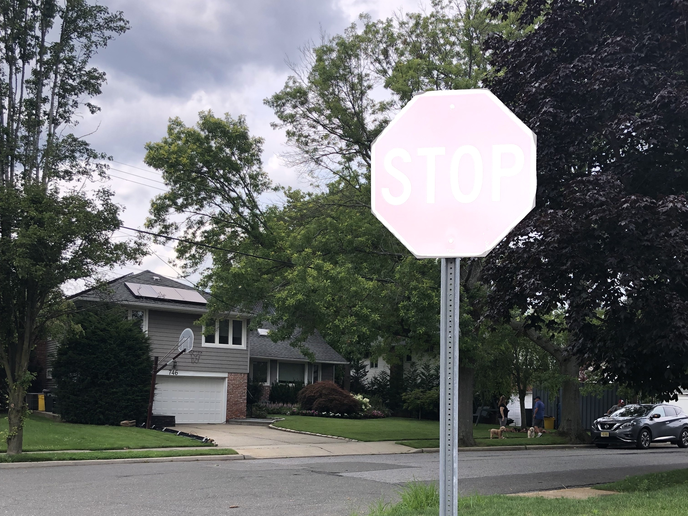

### Dermose canny repo 

use detectron2 to detection both hair base and follicle. Plot canny as well as orgin, use canny to find width/area of hair. Run locally with jupyterlab or python IDE.

### Requirements

VS Build tools 2019

python 3.8 tested and working 

```console

git clone https://github.com/facebookresearch/detectron2.git

cd detectron2

pip install -e .

```


